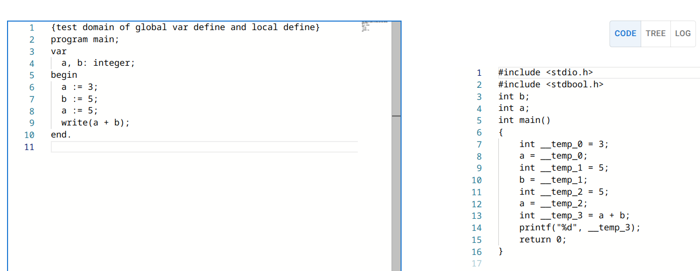
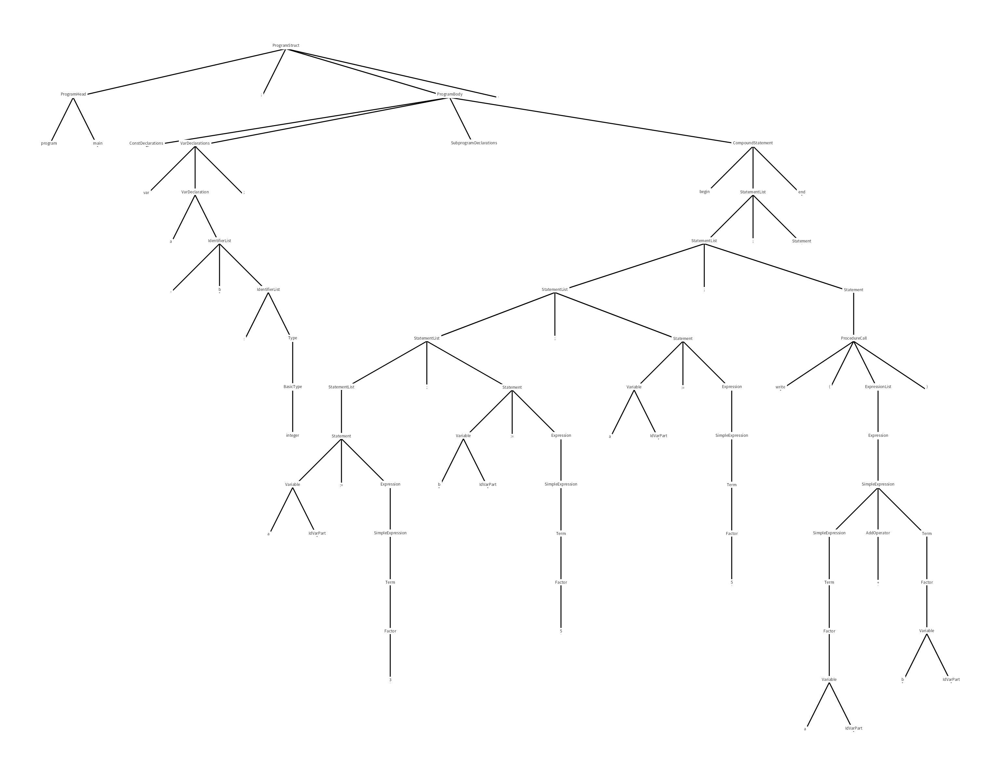

# Canon

北京邮电大学2021级编译原理与技术课程设计成果仓库。

## 课程设计要求

本次课程设计的要求为设计一个从Pascal-S语言到C语言的简单编译器，Pascal-S语言为Pascal语言的一个子集，需求中详细给出了该语言的语法定义。

课程设计的验收方式为头歌平台测试集验证与过程性评价两个部分组成。其中头歌平台类似于OJ平台，提供了一系列指定的输入Pascal-S程序和输出结果验证编译器是否正确工作。测试集由70个公开测试集和25个隐藏测试集组成，在隐藏测试集中可能存在部分测试点针对提供的Pascal-S语法进行了扩充，例如要求实现字符串的语法。过程性评价包括一次中期进度汇报和最后的验收汇报，最后提交的报告亦作为评分的依据之一。

## 本仓库中的实现

我们在此次课程设计中使用`dotnet`平台实现了一个名为`Canon`的Pascal-S编译器。

> Canon，中文名卡农，意为“规律”，亦是一种音乐作曲技巧。

编译器全部为自行编程实现，没有使用类似于`flex`和`bison`之类的前端辅助工具。词法分析使用自行实现的自动机算法，语法分析使用`LR(1)`文法，在项目中实现了一个简单的`LR(1)`分析器生成工具。语义分析和代码生成使用类似于语法制导翻译的技术，详细设计见课程设计说明。

### 项目结构

项目中由程序、文档、公开测试集测试工具三部分组成。

项目中程序使用`Visual Studio`的解决方案工具进行管理。程序中由`C#`项目组成：

- `Canon.Core`项目中的核心程序实现，包括实现编译器的所有核心代码。
- `Canon.Generator`项目，编译器中的`LR(1)`分析器生成工具。
- `Canon.Console`项目为命令行版本的编译器项目，负责编译器中的输入输出管理等的功能，并能够通过`NativAOT`功能输出为单个可执行文件。
- `Canon.Server`项目为服务器版本的编译器项目，提供了交互式编译的功能，并可以可视化的查看编译输出的语法树和C语言代码。
- `Canon.Tests`项目，单元测试项目。

项目中的最终报告文件使用`latex`撰写，报告的源代码在`docs`文件夹下，可以使用`latexmk`进行编译：

```shell
cd docs
latexmk main.tex
```

即可获得`CanonReport.pdf`文件。

项目中提供了一个公开测试集的自动测试工具，使用`python`编写，需要在系统中安装`fpc`编译器和`gcc`编译器。脚本会自动使用`fpc`编译器和自行实现的编译器`pascc`编译所有的公开测试集输入代码，并比对两个编译器输出文件的执行结果是否一致。使用方法可参见`CI`文件`.gitea/workflows/integration_test.yaml`。

### 构建

为了项目在头歌平台上运行，`Canon.Console`项目支持通过AOT编译，构建出一个静态链接musl libc的可执行文件。使用此种构建方式，除了需要安装.NET SDK，
还需要参考[交叉编译文档](https://learn.microsoft.com/zh-cn/dotnet/core/deploying/native-aot/cross-compile)安装相关的依赖，例如`clang`和`musl`。

使用下面指令进行编译：

```shell
cd Canon.Console
dotnet publish -r linux-musl-x64
```

编译好的可执行文件位于`bin/Release/net9.0/linux-musl-x64/publish`，可执行文件名为`Canon.Console`。

### 在线编译网站

为了获得更好的调试体验和更好的分数，我们提供了一个在线编译运行网站，在获得编译结果的同时可以绘制输入源代码的语法树。





该网站的后端位于`Canon.Server`中，该网站的前端位于`Canon.Server/client-app`中。

该网站的后端依赖`mongodb`数据库，使用`docker`可以方便的启动一个`mongodb`数据库实例：

```shell
docker run -d -p 27017:27017 mongo:7.0-jammy
```

启动网站后端：

```shell
cd Canon.Server
dotnet run
```

启动网站前端：

```shell
cd Canon.Server/client-app
pnpm install
pnpm run dev
```

## 支持

如果您在学习或者是抄袭的过程中发现了问题，我们十分欢迎您提出，您可以通过发起`issue`或者是发送电子邮件的方式联系我们。

